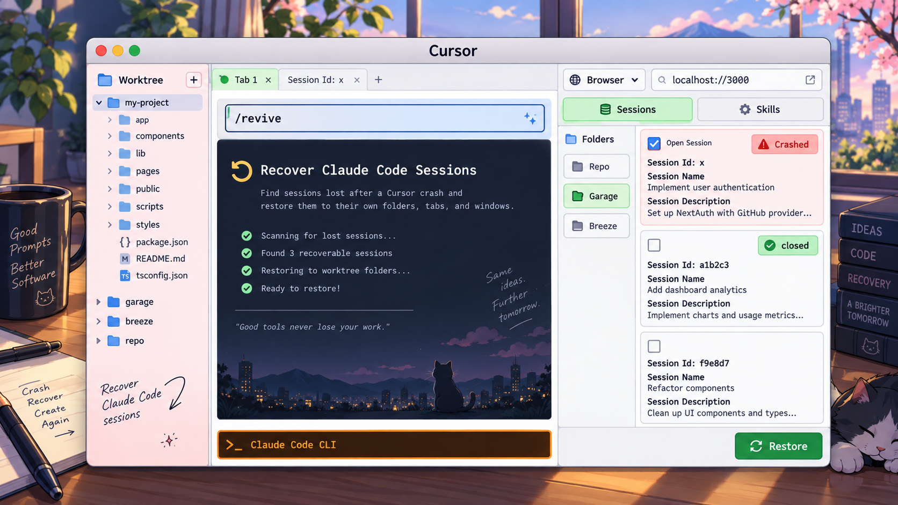

<p align="center">
  
</p>

<h1 align="center">Revive</h1>

<p align="center">
  Bring back Claude Code sessions that a Cursor crash took with it,<br>
  into the folders, tabs and windows they came from.
</p>

<p align="center">
  
  
  
  
  
</p>

<p align="center">
  
</p>

When Cursor dies, every terminal it owned dies with it, and every `claude`
session in those terminals goes too. The transcripts survive on disk, but
nothing knows which sessions were lost rather than finished, or where they
belong. `revive` records that as it happens and gives it back to you.

> **macOS only.** See [Platform support](#platform-support) before you clone.

## What it does

Three hooks record every session as it lives: where it ran, in which Cursor
window, and how it ended. When a session disappears, the record is enough to
tell a crash from an ordinary exit, and enough to put it back where it was.

```
$ revive.py list
4 session(s) look recoverable:

  window: port:35044
    1. api-gateway    2h    "why is the retry budget..."   Cursor died under it
    2. notes          40m   "summarise the meeting..."     window closed
```

A dashboard does the same thing with checkboxes, grouped by folder and status,
and restores a batch in one click.

**Bookmark the sessions you care about.** Some work is worth keeping a handle
on long after the crash that interrupted it. Starring a session pins it to the
top of the list and keeps it there across filters, reloads, server restarts and
your next reboot, so the thread you were pulling on is one click away instead of
somewhere in eight hundred rows. Bookmarks live in the registry rather than in
browser storage, because the dashboard opens on a fresh port every time and
anything kept in the browser would not survive that.

## How it decides

A crash and a closed tab deliver the **same** signal. Both send SIGHUP, and both
fire `SessionEnd` with reason `other`. The discriminator is whether Cursor's own
main process was still alive at the moment the session ended, which the
`SessionEnd` hook records.

| State | Meaning | Offered? |
|---|---|---|
| `CRASHED` | Cursor died under it, or it was killed outright | yes |
| `TERMINATED` | hung up or killed, tab closed | yes |
| `EXITED` | `/exit`, logout, `/clear` | no |
| `RUNNING` | still alive | no, restoring would duplicate it |

Only `/exit` and logout express an intention to stop. Everything else is loss,
and stays recoverable.

Within `TERMINATED` the card also says *how* it ended, because closing a window
and closing a tab both leave Cursor running:

| Signal at `SessionEnd` | Shown as |
|---|---|
| Cursor's main pid is gone | `app crash` |
| Cursor alive, the window's port stopped listening | `window closed` |
| Cursor alive, the port still listening | `tab closed` |
| no `SessionEnd` fired at all | `killed outright` |

Every Cursor window runs its own extension server on its own port, so the
listening socket is the window's heartbeat. The lock file is not: it is written
per window and is not removed reliably.

## Install

Requires macOS, Python 3.9 or newer, and Claude Code. No third-party packages.

```sh
git clone https://github.com/DrishtantKaushal/revive.git ~/.claude/skills/revive
python3 ~/.claude/skills/revive/scripts/install.py
```

That registers three hooks in `~/.claude/settings.json`, preserving any hooks
already there and taking a one-time backup. Sessions started from then on are
recorded. To remove them:

```sh
python3 ~/.claude/skills/revive/scripts/install.py uninstall
```

The dashboard ships prebuilt, so there is no build step. Rebuild it only if you
change the React source:

```sh
cd app && bun run build
```

## Use

```sh
revive.py            # the dashboard, the default
revive.py list       # what is recoverable, and why
revive.py pick       # terminal picker, space to toggle, enter to restore
revive.py restore <session-id> ...
revive.py backfill   # sessions from before the hooks existed
revive.py doctor     # health check
revive.py open       # where the dashboard opens: auto, cursor, browser
```

Sessions that predate the install have no record. Those are reconstructed from
`~/.claude/history.jsonl` and from the transcripts on disk, filtered by whether
`/exit` was typed. That filter is precise but recalls only about 65%, so it
excludes rather than guesses.

## Where sessions come back

Sessions are grouped by the **window** they lived in, the way a browser rebuilds
window structure rather than scattering tabs everywhere. Delivery is a job file
per window, claimed atomically by the window that owns that workspace root, so
two windows on the same folder can never both answer one job.

Hosts other than Cursor are supported where they can be driven honestly:

| Host | How |
|---|---|
| Cursor | companion extension, terminals in the editor area |
| tmux | one window per session inside a `revive` session |
| Terminal.app | AppleScript |
| Obsidian | bridge plugin plus a shell wrapper, see `install_obsidian.py` |

Anything else brings the app forward and hands you the exact commands rather
than putting the session somewhere it does not belong.

## The dashboard

Served on an ephemeral loopback port, guarded by a capability token minted per
launch. Requests are pinned to loopback origins. The token is never written to
the log, and both the log and the endpoint file are `0600`.

Inside Cursor it opens as a tab beside your terminal through the companion
extension. Elsewhere it opens in your browser. Force either with
`revive.py open cursor` or `revive.py open browser`.

What it holds on to for you:

- **Bookmarks**, which sort to the top and survive everything
- **Sort order**, by label or by when you last worked on a session
- **Where each folder should reopen**, when a folder is not a Cursor project
- **Selection**, which persists as you move between folders and statuses, so a
  batch can be gathered across all of them before you restore it

## Tests

```sh
python3 tests/test_logic.py     # 168 unit checks
bash tests/test_e2e.sh          #   6 real processes, real signals
bash tests/test_cleanroom.sh    #  31 clone, install into an empty HOME, run
bash tests/test_e2e_full.sh     #  14 real session, real crash, real restore
```

`test_cleanroom.sh` is the one that matters for a fresh install: it publishes
the tree, clones it, points `HOME` at an empty directory and installs as a
stranger would. Every first-run bug this project has had was invisible to the
unit suite and obvious to that one.

`test_e2e_full.sh` starts a real `claude`, kills it with `SIGKILL` so no clean
exit is recorded, restores it, and then confirms a live `claude --resume`
process exists in the original folder. It needs no credentials: hooks fire and
transcripts are written whether or not the session is authenticated.

## Platform support

macOS only, today. The code shells out to `ps`, `lsof`, `osascript`, `open`,
`pbcopy` and `sysctl`, reads `.app` bundles to identify hosts, and uses
POSIX-only process controls. There is no platform branching anywhere.

On Linux the hooks, the registry, classification, the dashboard and the CLI all
run, and the full unit suite passes. Process liveness works. What does not:
window detection needs `lsof`, boot time needs `sysctl kern.boottime`, host
detection looks for `.app` bundles, and none of the restore adapters apply.

On Windows it will install and do nothing useful.

Making it portable means putting the platform calls behind one interface and
writing a second implementation. The classification logic itself, which is the
hard part, is already platform independent.

## Layout

```
scripts/
  hook.py         the three hooks; the only writer of session records
  registry.py     records, classification, host detection, settings
  revive.py       discovery, grouping, restore, the CLI
  serve.py        the dashboard server
  install.py      hook installation
app/              the dashboard, React and Vite, prebuilt into app/dist
ui/index.html     dependency-free fallback dashboard
extension/        the Cursor companion extension
hosts/            the Obsidian bridge plugin and shell wrapper
tests/            four suites, 219 checks
```

Everything is stdlib. The dashboard's React source needs `bun` only if you
intend to change it.

## License

MIT
